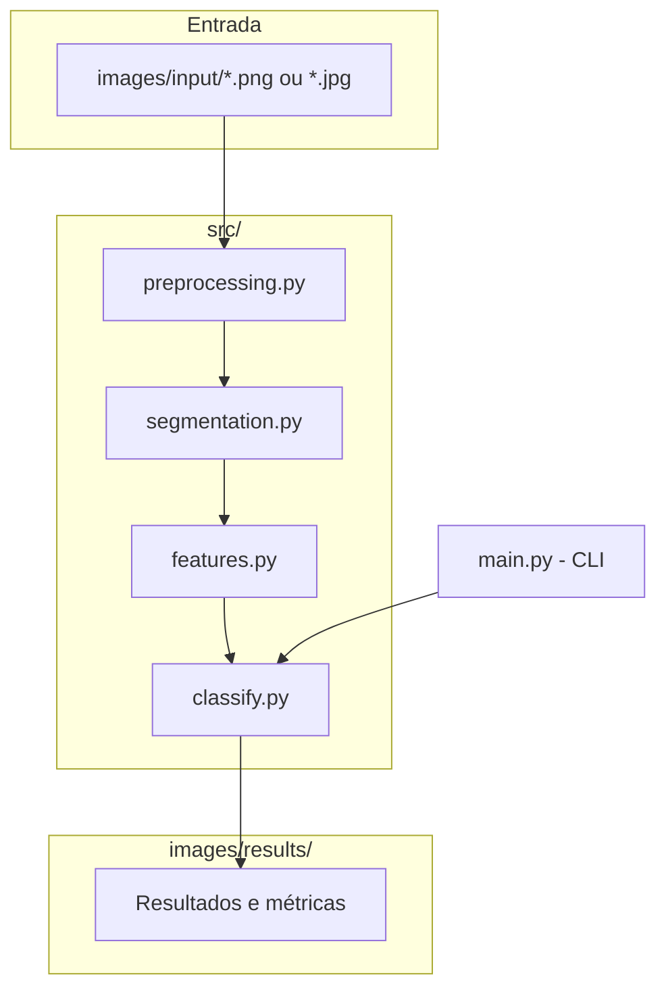

# Proposta — Identificação do Naipe em Cartas de Baralho

## 7.1 Problema

O problema é: **dada uma foto de uma carta de baralho francês (52 cartas), identificar automaticamente a qual dos quatro naipes ela pertence — copas, ouros, paus ou espadas.**

Isso envolve processamento e análise de imagem porque a informação de naipe está codificada visualmente em dois atributos combinados:

- **cor** do símbolo impresso na carta (vermelho para copas/ouros, preto para paus/espadas);
- **forma** do símbolo (coração, losango, trevo, pique), que distingue os dois naipes dentro de cada cor.

**Situação inicial:** uma foto de uma carta individual, tirada de cima, com a carta centralizada e a câmera fixa.

**Informação a ser produzida:** um rótulo entre `{copas, ouros, paus, espadas}`.

Delimitação explícita de escopo para a M1: o projeto identifica **apenas o naipe**, não o valor da carta (A, 2...K). Reconhecer o valor completo (13 classes, incluindo formas de números e figuras) é um problema mais amplo que poderá ser explorado como extensão nas etapas M2/M3, mas não faz parte do escopo atual.

## 7.2 Contexto de aplicação

Um contexto  para essa solução é a **automação de jogos de cartas** : uma câmera fixa acima de uma mesa de jogo (por exemplo, um app de mesa digital, um robô que organiza cartas, ou um assistente que lê cartas em voz alta) precisa identificar naipe e valor de cartas conforme elas são reveladas. Restringir o escopo da M1 a apenas o naipe permite validar a parte de segmentação e reconhecimento de forma/cor antes de acoplar o reconhecimento de valor, que é uma etapa adicional (mais classes, símbolos mais variados).

## 7.3 Objetivo

**Objetivo geral:** dado uma foto de uma carta de baralho francês, tirada com câmera fixa e carta centralizada, identificar corretamente o naipe da carta com alta acurácia.

**Objetivos específicos:**
- Implementar um pipeline de segmentação que isole o símbolo do naipe do fundo da carta.
- Extrair a cor dominante do símbolo (vermelho/preto).
- Extrair descritores de forma que distingam os dois naipes de cada cor.
- Combinar cor + forma em uma regra de classificação explicável (sem caixa-preta).
- Validar o pipeline com um conjunto inicial de imagens (sintéticas nesta fase de desenvolvimento; fotos reais do baralho físico como próximo passo imediato).

## 7.4 Entrada e saída esperadas

```
imagem da carta (foto, câmera fixa, carta centralizada)
   ↓
pré-processamento (RGB -> cinza -> binarização por Otsu)
   ↓
segmentação (bounding box do símbolo, recorte, cor dominante)
   ↓
extração de características de forma (fill_ratio, simetria vertical, perfil de largura)
   ↓
classificação por regras (cor + forma)
   ↓
resultado: naipe ∈ {copas, ouros, paus, espadas}
```

---

## 8. Imagens e dados

**Estado atual (M1):** o pipeline foi desenvolvido e validado com um conjunto de **20 imagens sintéticas** (5 por naipe), geradas programaticamente, desenhando os símbolos de cada naipe na cor correta com pequena variação de posição e tamanho para simular a variação que fotos reais teriam.

Essas imagens sintéticas **não substituem** as fotos reais exigidas pela M1 — servem para permitir desenvolver e testar o pipeline (segmentação, extração de cor, extração de forma, regras de classificação) antes da sessão de fotos com o baralho físico do grupo, que é o **próximo passo imediato**.

**Plano para as imagens reais:**
- Origem: baralho físico de um dos integrantes do grupo.
- Forma de obtenção: fotos tiradas com celular, câmera fixa (tripé ou apoio), carta centralizada sobre fundo de contraste uniforme (ex.: pano verde ou preto), boa iluminação.
- Quantidade planejada: pelo menos 3-5 fotos por naipe (13 cartas × 3-5 fotos = ~40-65 imagens), variando levemente ângulo e iluminação para dar robustez.
- Formato: JPEG/PNG, resolução de celular padrão (redimensionada para processamento).
- Restrições de uso: baralho de propriedade do grupo — sem restrição de redistribuição; as fotos serão incluídas diretamente no repositório.

## 9. Pipeline preliminar


| Etapa | Finalidade | Técnica considerada | Entrada | Saída | Dúvidas em aberto |
|---|---|---|---|---|---|
| Pré-processamento | Normalizar imagem, isolar símbolo do fundo | Conversão RGB→cinza (luminância), binarização por Otsu (implementado manualmente) | Imagem RGB | Imagem binarizada (símbolo vs. fundo) | Threshold de Otsu vai se comportar bem com o fundo real (pano) e reflexos do verniz da carta? |
| Segmentação | Localizar e recortar a região do símbolo | Bounding box dos pixels não-zero da máscara binária; cor dominante por média dos canais RGB nos pixels do símbolo | Imagem binarizada + RGB original | Recorte RGB + máscara do símbolo, rótulo de cor | Com fotos reais, pode haver mais de uma região de símbolo (ex. dois cantos visíveis) — vai ser preciso escolher/agrupar regiões |
| Extração de forma | Gerar descritores que diferenciem os naipes de mesma cor | `fill_ratio`, `vertical_symmetry`, `width_profile_ratio` (implementados manualmente a partir da máscara) | Máscara recortada | Vetor de características | Os limiares calibrados nas imagens sintéticas provavelmente vão precisar de reajuste com fotos reais |
| Classificação | Decidir o naipe final | Regras com limiares sobre cor + descritores de forma | Cor + vetor de características | Rótulo de naipe | Regras fixas podem não generalizar bem; alternativa a considerar na M2: comparação por template matching ou um classificador simples treinado (ex. k-NN sobre os descritores) |

### Alternativas consideradas


    A[Símbolo segmentado] --> B1[Regras sobre descritores de forma - ATUAL]
    A --> B2[Template matching - comparar com símbolo de referência]
    A --> B3[Classificador k-NN sobre vetor de descritores]

    B1 --> C[Comparar acurácia e robustez]
    B2 --> C
    B3 --> C


Optamos por começar pela abordagem de regras (B1) por ser totalmente explicável e não exigir dados de treinamento. Template matching (B2) e um classificador leve (B3) ficam como alternativas a comparar durante a M2, especialmente se as regras fixas não generalizarem bem para fotos reais com variação de iluminação e ângulo.

## 10. Arquitetura preliminar



Organização de módulos (cada um com responsabilidade única, testável isoladamente):
- `preprocessing.py`: carregamento, conversão de espaço de cor, binarização (Otsu manual).
- `segmentation.py`: bounding box, recorte, detecção de cor dominante.
- `features.py`: descritores de forma.
- `classify.py`: combina os módulos anteriores e aplica a regra de decisão.
- `main.py`: ponto de entrada via linha de comando.
- `generate_synthetic_cards.py`: gerador de dados sintéticos de desenvolvimento (temporário, até termos fotos reais).

## 11. Estudo inicial de viabilidade

Evidências reunidas até o momento:

1. **Prototipagem funcional completa**: o pipeline foi implementado ponta a ponta (pré-processamento → segmentação → features → classificação) e roda sem erros sobre um conjunto de imagens de teste.
2. **Testes automatizados (pytest)**: 9 testes cobrindo binarização, segmentação, detecção de cor e classificação completa, todos passando.
3. **Resultado preliminar quantitativo**: 100% de acerto (20/20) nas imagens sintéticas de desenvolvimento. Esse número é esperado ser mais alto que o obtido com fotos reais, já que as imagens sintéticas têm cor e forma muito mais limpas/controladas que uma foto real (sem sombra, reflexo ou variação de iluminação).
4. **Inspeção manual da lógica**: os descritores de forma escolhidos (simetria vertical, perfil de largura topo/base) têm justificativa geométrica clara e observável nos símbolos reais dos naipes (ouros é simétrico como um losango; copas tem reentrância no topo; paus é mais largo na base pelos três lóbulos; espadas é mais afilado no topo).
5. **Baralho físico disponível**: o grupo tem acesso a um baralho completo para a sessão de fotos reais, sem dependência de datasets externos ou problemas de direitos autorais.

**Riscos identificados para a M2:**
- Fotos reais terão ruído (sombra, reflexo no verniz, variação de ângulo) que as imagens sintéticas não têm — os limiares de decisão precisarão ser recalibrados, e pode ser necessário trocar de abordagem de regras fixas para algo mais robusto (template matching ou classificador leve).
- A posição do símbolo do naipe na carta real (geralmente no canto, pequeno, ao lado do valor) é diferente da posição centralizada usada nas imagens sintéticas — o pipeline de segmentação vai precisar lidar com o recorte da região do canto especificamente.

## 12. Resultados/experimentos preliminares

**Experimento:** classificação de naipe em 20 imagens sintéticas.

- **Entrada:** imagens 200×200, símbolo desenhado em cor e posição levemente variadas.
- **Método:** pipeline completo (Otsu → segmentação → 3 descritores de forma → regras de decisão).
- **Parâmetros:** threshold de binarização calculado automaticamente por Otsu em cada imagem; limiares de classificação fixos (`vertical_symmetry > 0.75` para separar ouros/copas; `width_profile_ratio < 0.9` para separar paus/espadas).
- **Saída:** ver `images/results/resultados_sinteticos.json`.
- **Interpretação:** 100% de acerto nas sintéticas confirma que a lógica de decisão é internamente consistente com os descritores escolhidos. Isso é um resultado esperado e não deve ser interpretado como desempenho final do sistema — é evidência de que o *pipeline funciona*, não de que ele vai generalizar bem para fotos reais. A validação real acontecerá na próxima etapa, com fotos do baralho físico.

## Próximos passos (para M2)

1. Fotografar o baralho físico (13 cartas × 3-5 fotos cada) com câmera fixa.
2. Adaptar a segmentação para recortar o símbolo do **canto** da carta (não o centro).
3. Recalibrar os limiares de `classify.py` com base nas fotos reais.
4. Avaliar se as regras fixas continuam suficientes ou se vale migrar para template matching / k-NN.
5. (Extensão futura, fora do escopo da M1) considerar reconhecimento do valor da carta além do naipe.

## Referências

- OpenCV / scikit-image docs sobre binarização e Otsu (consultadas para validar a implementação manual do método).
- Material da disciplina de Processamento de Imagens (2026-02), especialmente os laboratórios M1.1 e M1.2, que motivaram o cuidado com conversão explícita para RGB antes de qualquer operação em array.
